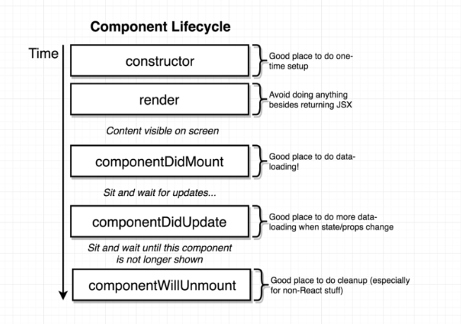
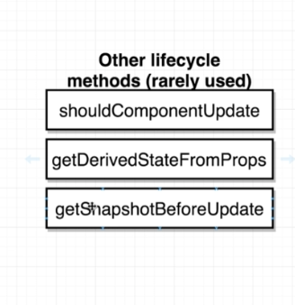
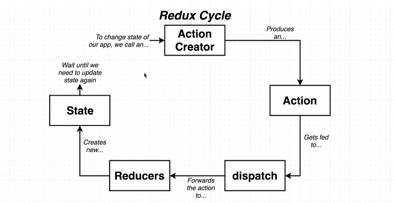
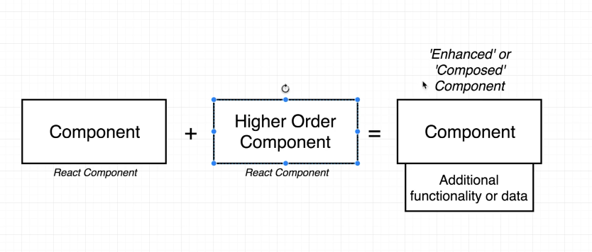
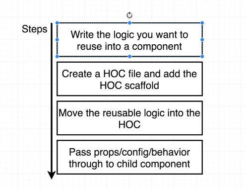

# React

Renders your UI and responds to events
AKA: the "V" in MVC

Declarative - easier to reason about, predict, and debug
Component-Based - encapsulated components manage their own state

Consists of two libraries - React & ReactDOM

React is the code which determines what a React Component is and how components work together
ReactDOM takes the components and builds the virtual DOM

## Buidling Components, Not Templates

Separation of Concerns - reducing coupling and increasing cohesion

Coupling is - the degree to which each program module relies on each of the other modules
Cohesion - the degree to which elements of a module belong together

Display logic and markup are inevitably tightly coupled. How do you find DOM nodes?

Display logic and markup are highly cohesive. They both show in the UI.

Templates tend to separate technologies, not concerns. In addition, templates are `underpowered`. This results in :
- Reliance on primitive abstractions
- Inventing lots of new concepts that already exist in JavaScript

Pete Hunt, React -
  "The framework cannot know how to separate your concerns for you. It hsould only provide `powerful expressive tools` for the user to do it correctly."

A lot of frameworks force you into an MVC model. MVC has it's advantages, but this can result in bloating. In addition, the vocabulary you use is that of the framework and not of your appliation.

React components are `highly cohesive` building blocks for UIs `loosely coupled` with other components.

React wants you to use `components` to separate your concerns with the full power of JavaScript, not a templating language.

Components are:
- reusuable
- composable
- units (testable)
- small (don't write spaghetti code)

Only write display logic in your components!

React has the `accessibity` of templates and the `power` of JavaScript.

## Data Changes

When `data changes`, React re-renders the entire component. React components are basically just idempotent functions. They describe your UI at `any point in time`, just like a server-rendered app.

Idempotence is the property of certain operations in mathematics and computer science whereby they can be applied multiple times without changing the result beyond the initial application.

Re-rendering on every change makes things simple. Every place data is displayed is guaranteed to be up-to-date, without data binding magic, or model dirty checking. There are no more explicity DOM operations - `everything is declarative`

In computer science, declarative programming is a programming paradigm—a style of building the structure and elements of computer programs—that expresses the logic of a computation without describing its control flow.

Rerending on every change sounds expensive. That's way React has a `virutal DOM`

## Virutal DOM

The `virtual DOM` makes re-rendering on every change `fast`. You can't just throw out the `DOM` and rebuilt it on each update. It's too slow and you'll lose form state and scroll position. Therefore, react built a `virtual DOM` (and events system) optimized for performance and memory footprint.

How it works:

On every `setState` call, React...

- builds a new `virtual DOM` subtree
- diffs the new tree with the old one
- computes the minimal set of DOM mutations and puts them in a queue
- and batch executes all updates

It's `fast` because the DOM is slow. React computes minimal DOM operations and batches reads and writes for optimal performance. It has automatic top-level `event delegation` (with cross-browser HTML5 events) which creates synthetic events. It provides hooks for `custom update logic`, though they're alomst never used.

React runs at `60 fps`.
`Re-render` don't mutate!

## JSX

An `optional` syntax extension to JavaScript containing a combination of HTML and JS syntax. After compilation, JSX expressions become regular JavaScript function calls and evaluate to JavaScript objects. This means that you can use JSX inside of if statements and for loops, assign it to variables, accept it as arguments, and return it from functions.

### Specifying Attributes with JSX

With string literals:

```javascript
const element = <div tabIndex="0"></div>;
```

With embedded JavaScript expressions:

```javascript
const element = </img>;
```

Don’t put quotes around curly braces when embedding a JavaScript expression in an attribute. You should either use quotes (for string values) or curly braces (for expressions), but not both in the same attribute.

React DOM uses camelCase for it's property naming.

JSX prevents injection attacks by escaping embedded values by default and ensures that you can never inject anyting that's not explicity written in your application.

Babel compiles JSX down to `React.createElement()` calls

```javascript
const App = () => { return <div className="app">Hello</div> }
```

compiles to this:

```javascript
const App = () => { return /*#__PURE__*/React.createElement("div", { className: 'app' }, "Hello"); };
```

## Rendering Elements

Elements are the smalled building blocks of React apps. Unlike brower DOM elements, React elements are plain objects and are cheap to create. React DOM takes care of updating the DOM to match the React elements.

### Rendering an element to the DOM

Create a `root` DOM node on an html file:

```html
<div id="root"></div>
```

Use the `render` method via `ReactDOM` to render a given element.

```javascript
const element = <h1>Hello, world</h1>;
ReactDOM.render(element, document.getElementById('root'));
```

### Updating Rendered Elements

React elements are `immutable`. Once you create an element, you can't change it's children or attributes. An element is like a single frame in a movie: it represents the UI at a certain point in time. The only way to update the UI is to create a new element, and pass it to `ReactDOM.render()`.

The code below calls `ReactDOM.render` on every interval:

```javascript
function tick() {
  const element = (
    <div>
      <h1>Hello, world!</h1>
      <h2>It is {new Date().toLocaleTimeString()}.</h2>
    </div>
  );
  ReactDOM.render(element, document.getElementById('root'))
}

setInterval(tick, 1000)
```

In practice, most React apps only call `ReactDOM.render()` once.

React updates only what is necassary. React DOM compares the element and its children to the previous one, and only applies the DOM updates necessary to bring the DOM to the desired state.

## Components and Props

Components let yuou split the UI into independent, reusable pieces, and think about each piece in isolation. Conceptually, components are like JavaScript functions. They accept arbitrary inputs (called “props”) and return React elements describing what should appear on the screen.

### Rendering Components

When React sees an element representing a user-defined component, it passes JSX attributes and children to this component as a single object. We call this object `props`.

```javascript
function Welcome(props) {
  return <h1>Hello, {props.name}</h1>;
}

const element = <Welcome name="Sara" />;
ReactDOM.render(
  element,
  document.getElementById('root')
);
```

Recap of what is happening in the above sample:

1. We call `ReactDOM.render()` with the <Welcome name="sara" /> element
2. React calls the `Welcome` component with `{ name: 'Sara' }` as the props.
3. Our `Welcome` component returns a `<h1>Hello, Sara</h1>` element as the result.
4. React DOM efficiently updates the DOM to match `<h1>Hello, Sarah</h1>`.

Always name Components with a capital letter

### Composing Components

Components can refer to other components in their output. This lets us use the same component abstraction for any level of detail. A button, a form, a dialog, a screen: in React apps, all those are commonly expressed as components.

For example, we can create an App component that renders Welcome many times:

```javascript
function Welcome(props) {
  return <h1>Hello, {props.name}</h1>;
}

function App() {
  return (
    <div>
      <Welcome name="Sara" />
      <Welcome name="Cahal" />
      <Welcome name="Edite" />
    </div>
  )
}

ReactDOM.render(
  <App />,
  document.getElementById('root')
)
```

### Extracting Components

Don't be afraid to split components into smaller components.

The `Comment` component below takes in an `author` (object), `text` (a string), and `date` as props and describes a comment on social media.

```javascript
function Comment(props) {
  return (
    <div className="Comment">
      <div className="UserInfo">
        /* extract me */
        
        /* extract me */
        <div className="UserInfo-name">
          {props.author.name}
        </div>
      </div>
      <div className="Comment-text">
        {props.text}
      </div>
      <div className="Comment-date">
        {formatDate(props.date)}
      </div>
    </div>
  );
}
```

First, extract `Avatar`

```javascript
function Avatar(props) {
  return (
    
  )
}
```

`Avatar` doesn't need to know that is is being rendered inside a `Comment`. This is why we have given it's prop a more generic name: `user` rather than `author`. It is recommended to name props from the component’s own point of view rather than the context in which it is being used. 

Now, we can inject `Avatar` as a child component to `Comment`:

```javascript
function Comment(props) {
  return (
    <div className="Comment">
      <div className="UserInfo">
        <Avatar user={props.author} />
        <div className="UserInfo-name">
          {props.author.name}
        </div>
      </div>
      <div className="Comment-text">
        {props.text}
      </div>
      <div className="Comment-date">
        {formatDate(props.date)}
      </div>
    </div>
  );
}
```
You can futher simplify the `Comment` component by extracting a `UserInfo` component that renders an Avatar next to the user’s name:

```javascript
function UserInfo(props) {
  return (
    <div className="UserInfo">
      <Avatar user={props.user} />
      <div className="UserInfo-name">
        {props.user.name}
      </div>
    </div>
  );
}
```

`Comment` is looking lean!

```javascript
function Comment(props) {
  return (
    <div className="Comment">
      <UserInfo user={props.author} />
      <div className="Comment-text">
        {props.text}
      </div>
      <div className="Comment-date">
        {formatDate(props.date)}
      </div>
    </div>
  )
}
```

### Props

Props are `Read-Only`. Whether you declare a component as a `function` or `class`, it must NEVER modify its own `props`. Consider this `sum` function:

```javascript
function sum(a, b) {
  return a + b
}
```

This function is `pure`, because it does not attempt to change their inputs and always return the same result for the same inputs. In contrast, this function is `impure` because it changes its own input:

```javascript
function withdraw(account, amount) {
  account.total -= amount
}
```

React is flexible, but has one very strict rule:

`All React components must act like pure functions with respect to their props.`

In computer programming, a `pure function` has the following properties:

1. It's return value is the same for the arguments (no variation with local static variable, non-local variables, mutable reference arguments or I/O streams)

2. It's evaluation has no side effects (no mutation of static variables, non-local variables, mutable reference arguemnts or I/O streams)


### Functional Component

```javascript
function Welcome(props) {
  return <h1>Hello, {props.name}</h1>;
}
```

### Class Components

```javascript
class Welcome extends React.Component {
  render() {
    return <h1>Hello, {this.props.name}</h1>;
  }
}
```

### Converting a Function to a Class

1. Create an [ES6 Class](https://developer.mozilla.org/en-US/docs/Web/JavaScript/Reference/Classes)
2. Add a single empty method to it called `render()`
3. Move the body of the function into the `render()` method
4. Replace props with `this.props` in the `render` body
5. Delete the remaining empty function declaration

This:

```javascript
function Clock(props) {
  return (
    <div>
      <h1>Hello, world!</h1>
      <h2>It is {props.date.toLocaleTimeString()}.</h2>
    </div>
  );
}
```

To this:

``` javascript
class Clock extends React.Component {
  render() {
    return (
      <div>
        <h1>Hello, world!</h1>
        <h2>It is {this.props.date.toLocaleTimeString()}.</h2>
      </div>
    );
  }
}
```

Render the component:

```javascript
function tick() {
  ReactDOM.render(
    <Clock date={new Date()} />,
    document.getElementById('root')
  );
}

setInterval(tick, 1000);
```

The render method will be called each time an update happens, but as long as we render `<Clock />` into the same DOM node, only a single instance of the Clock class will be used.

## Adding Local State to a Class

With the above example, we will move the `date` from props to state like so:

1. Replace `this.props.date` with `this.state.date` in the `render()` method.
2. Add a [Class Constructor](https://developer.mozilla.org/en-US/docs/Web/JavaScript/Reference/Classes#Constructor) that assigns the initial `this.state`
3. Pass `props` to the base constructor. `Class` components should always call the base constructor with `props`
4. Remove the `date` props from the `<Clock />` element

The result is this:

```javascript
class Clock extends React.Component {
  constructor(props) {
    super(props)
    this.state = {date: new Date()}
  }

  render() {
    return (
      <div>
        <h1>Hello, world!</h1>
        <h2>It is {this.state.date.toLocaleTimeString()}.</h2>
      </div>
    )
  }
}

ReactDOM.render(
  <Clock />,
  document.getElementById('root')
)
```

But we will need to have the clock update itself every second

## Adding Lifecycle Methods to a Class

## State

- Only usable with class components (unless you are using hooks!)
- Props are not state
- State is a JS object that contains data relevant to a component
- Updating 'state' on a component causes the component to (almost) instantly re-render
- State must be initialized when a component is created
- State can only be updated using the function `setState`

## Life Cycle Methods

- `constructor`
- `render`
  content (jsx) visible on screen
- `componentDidMount` (called one time)
  sit and wait for updates (setState is called)
- `componentDidUpdate`
  sit and wait until this component is no longer shown; `render` will be called first
- `componentWillUnmount` (clean up)

### Construstor

Good for one time set up, such as setting your initalState. Technically, you can fetch data here, but it is not recommended. If we centralize our data fetching logic inside one centralized lifecycle (`componentDidMount`), then it will lead to more clear code.

### Render

returns `JSX`

It's best to avoid conditional logic (or logic in general) inside the render function. You can define a function, such as `renderList` or `renderContent` outside of the `render` function and you can all that function inside the `render` function.

For example:

```javascript
renderContent() {
  if (this.state.loading) {
    return <Spinner />
  }

  if (this.state.redirect) {
    return <Redirect />
  }

  return <Content />
}

render() {
  return <div>{this.renderContent()}</div>
}
```

### componentDidMount

Perfect for running an outside process or fetching data upon initialization.

### componentDidUpdate

This lifecyle is called anytime our data changes, via `setState` or when a component receives a new `prop` from it's parent

### componentWillUnmount

Good for cleanup, especially non-React stuff





## Redux

- State management library
- Make creating complex appliations easier
- Not required to create a React app!
- Not explicity designed to work with React

## The Redux Cycle

Action Creator (Person dropping off the form) -> Action (the form) -> dispatch (form reciever) -> Reducers (departments) -> State (central repository)

An analogy!

We are building an insurance company

Policy - customer holds a 'policy' if bad stuff happens to them then we pay them
Claim - custom had something bad happen to them, we need to pay them

Customer fills out a `form`
The customer hands the `form` to the Form Reciever
The Form Reciever makes a copy of the `form` for each department:

Claims History - stores a list of all claims ever made
Policies - stores a list of who has a poliby with our insurance company
Accounting - stores a big bag of cash, we pay people from this

A particular department may not care or need to do anything with a particular from, but they recieve a copy

Inside each department:

Policies Department

`form` to sign up for a policy
|
List of Customers with Policies

- Fred
- Jane
- Alex

Management comes in and asks to see the list of policy holders and stores them in a separate repository separate from the Policy Department. The management team will have access to the list of policy holders, without going back to that department. The same idea applies to the other departments. All data is stored in a central repository

`form` -> claim (type) | name: 'Alex', Amount: \$500 (payload)

(3) different types of forms:

CREATE_POLICY | CREATE_CLAIM | DELETE_POLICY

### Action Creator

An action creator is a function that creates or returns a plain javascript object. This object has an action `type` and a `payload`. The `type` property describes the change we want to make inside of our data. The `payload` propety provides context around the change we want to make.

### Action

The purpose of an action is to describe some change we want to make to the data inside of our application.

### Dispatch

The dispatch function take in an action, make copies of that object and passes it to many areas of our application (reducers)

### Reducer

A reducer is a function that is reponsible for taking in an action and some sort of data (payload). It is going to process that action and makes a change to the data, then returns the data so it can be stored in a central location.

### State

State is a central repository of all data that has been created by our reducers. You can't get access to state directly. You must create an action and pass it to a reducer

## Why Redux

As an app grows, so does it's complexity
With Redux, this curve flattens. Redux helps with self-documentation and escapsulation



## React-Redux

React -> React-Redux -> Redux

React-Redux allows react and redux to work together

Absolutely understand the purpose of reducers
Absolutely understand making API requests with Redux
Absoletely understand the purpose of middleware, specifically 'redux thunk'

## Higher Order Components

A react component made to help us resuse code



The `connect` component provided by `react-redux` is an example of a higher order component

### Steps to Create a HOC



By convention, we name our HOC files leading with a lowercase letter. `requireAuth.js`. This is because, this helps differentiate files that returns a `function` vs a class

We need to make sure we pass props to our child component like so:

```javascript
<ChildComponent {...this.props} />
````
