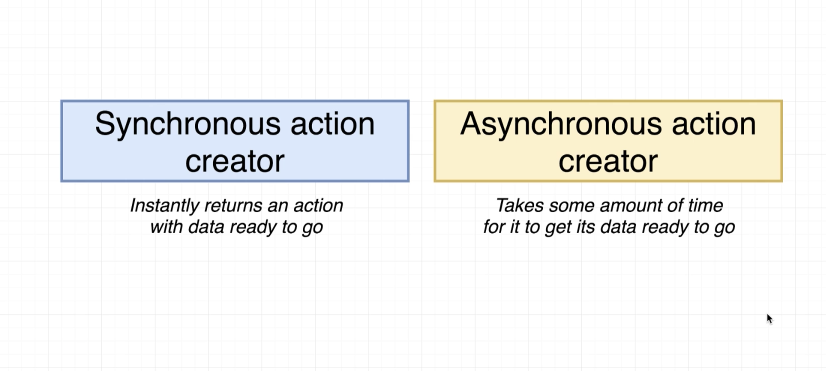
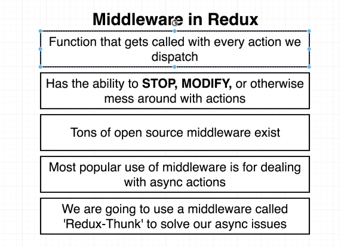
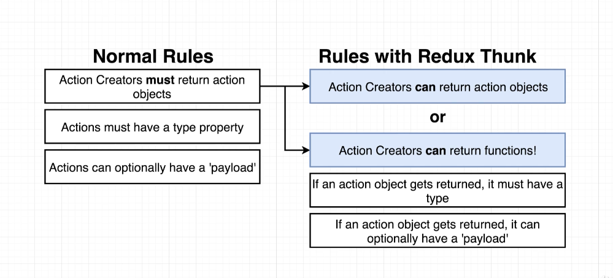
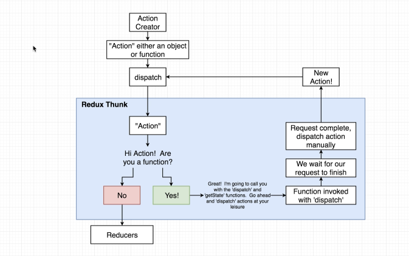
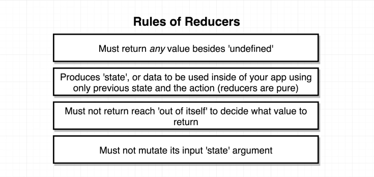
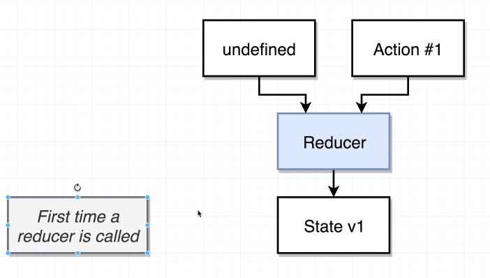
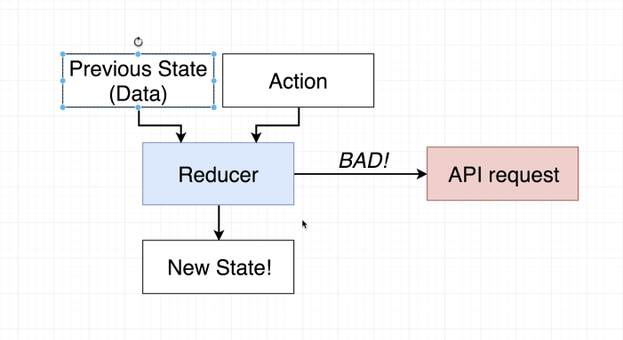
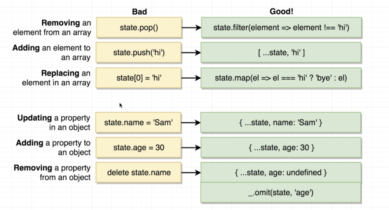

# Redux Thunk

Middleware tohelp us make requests in a redux appliation

## General Data Loading w/ Redux


Components are generally responsible for fetching data they need by calling an action creator
Action creators are responsible for making API requests
We get fetched data into a component by generating new state in our redux store, then getting that into our component through `mapStateToProps`

### Bad Action Creator Practice

```javascript
export const fetchPosts = async () => {
  const response = await jsonPlaceHolder.get('/posts')
  return {
    type: 'FETCH_POSTS',
    payload: response,
  }
}
```


Actions must be plain objects with a type property. You must use custom middleware for async actions

### What isn't happening


### What is actually happening


### Async Action Creators



### What is Middleware



### What is Redux-Thunk

Redux-Thunk relaxes the 'normal' rules around an action creator. It is an all-purpose middleware to deal with async actions and allows actions creators to return a function.





Dispatch and getState allow for unlimited power with our redux side of our app
...with dispatch, we make changes
...with getState, we can read anything we want

### Redux-Thunk Source Code

```javascript
function createThunkMiddleware(extraArgument) {
  return ({ dispatch, getState }) => (next) => (action) => {
    if (typeof action === 'function') {
      return action(dispatch, getState, extraArgument)
    }

    return next(action)
  }
}

const thunk = createThunkMiddleware()
thunk.withExtraArgument = createThunkMiddleware

export default thunk
```

### How to Apply Redux-Thunk

```javascript
import React from 'react'
import ReactDOM from 'react-dom'
import { Provider } from 'react-redux'
import { createStore, applyMiddleware } from 'redux'
import thunk from 'redux-thunk'

import App from './components/App'
import reducers from './reducers/index'

const store = createStore(reducers, applyMiddleware(thunk))

ReactDOM.render(
  <Provider store={store}>
    <App />
  </Provider>,
  document.querySelector('#root')
)
```

### Rules of Reducers



The first time a reducer gets invoked, the state object is undefined, therefore, we need to default argument to an initial state value.

The second time (and after) the reducer gets invoked, the state object is truthy (first version and so on...).

The only thing that changes, it the action object.



A reducer must be pure and must not reach out of itself!



A reducer must mutate it's input state argument.

#### Mutations In JavaScript

We can't mutate objects or arrays. This is an extremely bad practice because redux checks for compares the objects in memory. If you simply mutate state, redux won't detect a new object in memory, will return the current state, and won't re-render.

```javascript
const colors = ['red', 'green']
colors.push('purple') // returs 3
```

or...

```javascript
const profile = { name: 'Alex' }
profile.name = 'Sam'
```

We don't need to worry about...

```javascript
const name = 'Sam'
name[0] = 'X'
console.log(name) // prints 'Sam'
```

We need to a copy of our state object and change the properties we want of that copy.

```javascript
return {
  ...state,
  posts: state.posts,
}
```

### Safe State Updates in Reduers



Lodash's `omit` function is really handy for removing a property from an object without mutating state

### Other Notes

`mapStateToProps` takes in `state` as well as `ownProps`

You can manually dispatch by passing in an invoked action creator into the `dispatch` function. That action creator, must call dispatch an action object.

```javascript
dispatch(fetchPosts())

export const fetchPosts = () => async (dispatch) => {
  const response = await jsonPlaceHolder.get('/posts')

  dispatch({
    type: 'FETCH_POSTS',
    payload: response.data,
  })
}
```

### Configuring Redux Dev Tools

```javascript
const store = createStore(
  reducers,
  compose(
    applyMiddleware(thunk),
    window.__REDUX_DEVTOOLS_EXTENSION__ && window.__REDUX_DEVTOOLS_EXTENSION__()
  )
)
```
