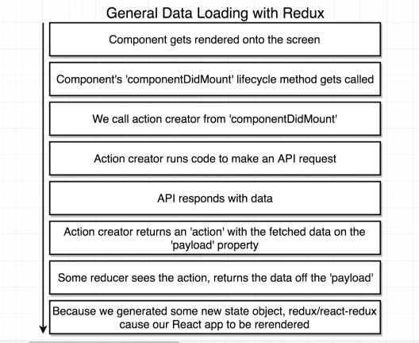
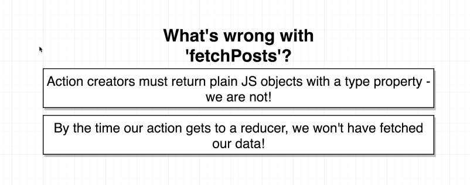
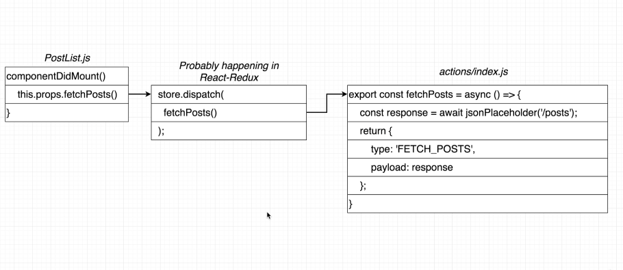
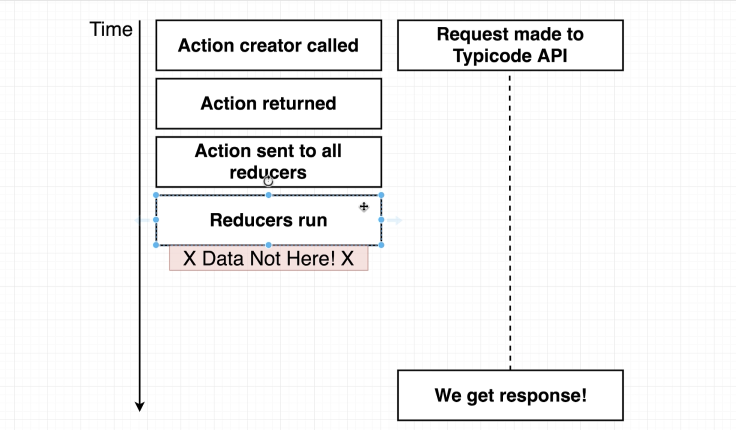

# Redux Thunk

Middleware tohelp us make requests in a redux appliation

## General Data Loading w/ Redux



Components are generally responsible for fetching data they need by calling an action creator
Action creators are responsible for making API requests
We get fetched data into a component by generating new state in our redux store, then getting that into our component through `mapStateToProps`

### Bad Action Creator Practice

```javascript
export const fetchPosts = async () => {
  const response = await jsonPlaceHolder.get('/posts')
  return {
    type: 'FETCH_POSTS',
    payload: response,
  }
}
```



Actions must be plain objects with a type property. You must use custom middleware for async actions

### What isn't happening



### What is actually happening



