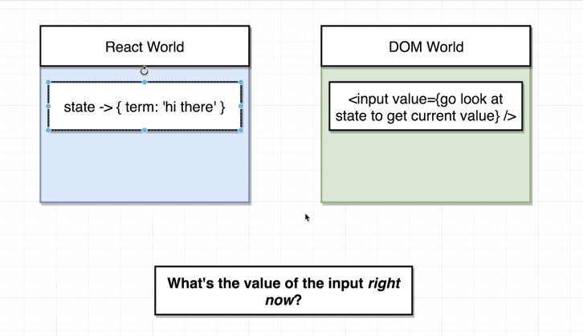

# Forms

## Controlled

Properties are stored in state and pushed into elements

## Uncontrolled

Properes are stored in the dom



## Binding Methods

Javascript thinks `this` references `undefined` and not our `class`. Anytime (in javascript) you want figure out the value of `this` inside of a function, you need to look at where the function is called (look to the left of the `.`)

```javascript
  onFormSubmit(e) {
    e.preventDefault()
    console.log(this.state.term)
    this.setState({ term: '' })
  }
```

When we pass this function down to an element, there is no reference to `this`

```jsx
  <form onSubmit={this.onFormSubmit}>
```

Therefore, we need to `bind` `onFormSubmit` to `this` inside our `class`

We can call a constructor to bind like so:

```javascript
constructor() {
  this.onFormSubmit = this.onFormSubmit.bind(this)
}
```

This produces a version of this function and is fixed (binded) to `this`

Or... you can make onFormSubmit a fat arrow func

```javascript
onFormSubmit = () => {
  // stuff goes here
}
```

Or... you can wrap `this.onFormSubmit` in a fat arrow callback function

```jsx
<form onSubmit={() => this.onFormSubmit()}>
```

### React Refs

- Gives access to a single DOM element
- We create refs in the constructor, assign them to instance variables, then pass them to a particular JSX element as props

```javascript
  constructor(props) {
    super(props)

    this.imageRef = React.createRef()
  }
```

You can perform DOM manipulation from here, such as adding event listenters:

```javascript
  componentDidMount() {
    this.imageRef.current.addEventListener('load', this.someFunc)
  }
```
