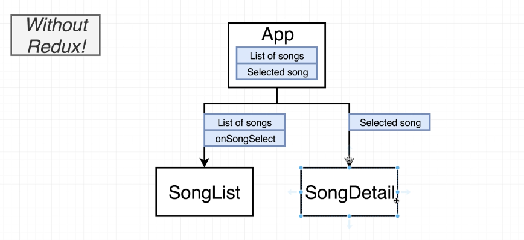
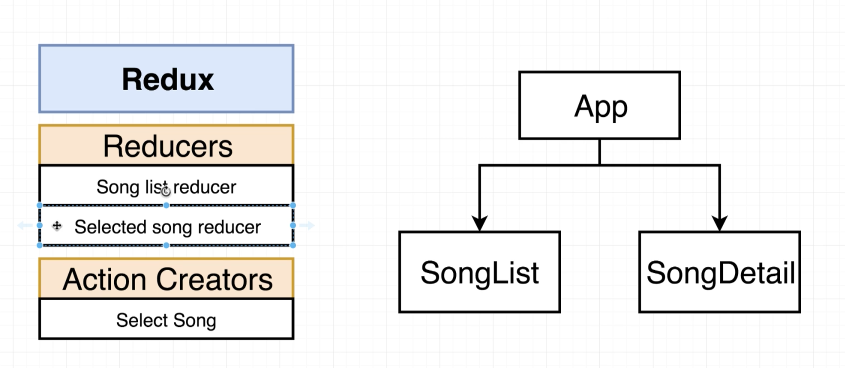
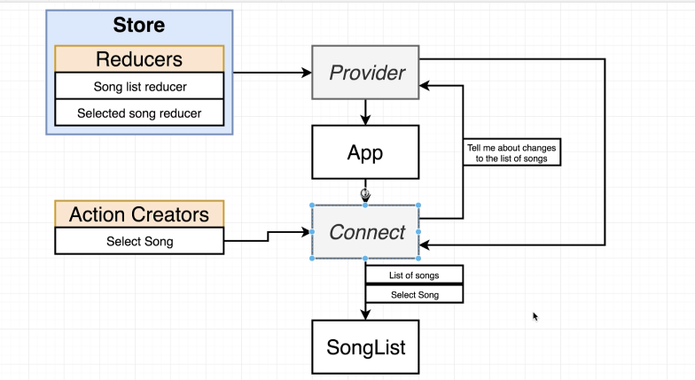
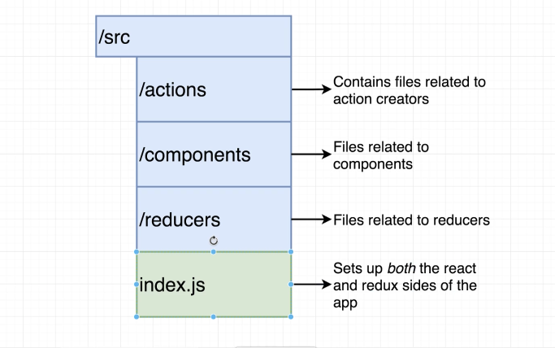

# React Redux Demo

## How React-Redux Works

`Provider` (context system - allows a parent component to communcate with a child component down the tree)
`App`
`Connect` (communcates with the provider)
`SongList`

`createStore` - creates a store; pass your in your reducers

Provider and connect are provided by `react-redux`

## Project Structure

## Redux Is Not Magic

Redux does not automatically detect action creators being called
Redux does not automatically detect a function returning an object that is an 'action'

The `connect` function takes actions and wraps them in another javascript function. When this function called, it takes the creator, returns the action, and automatically calls the dispatch function for us.
