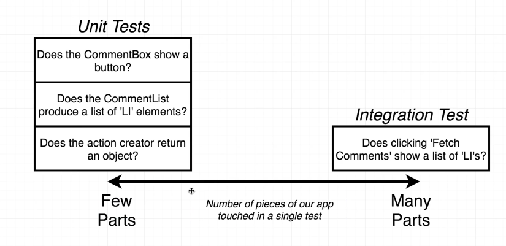
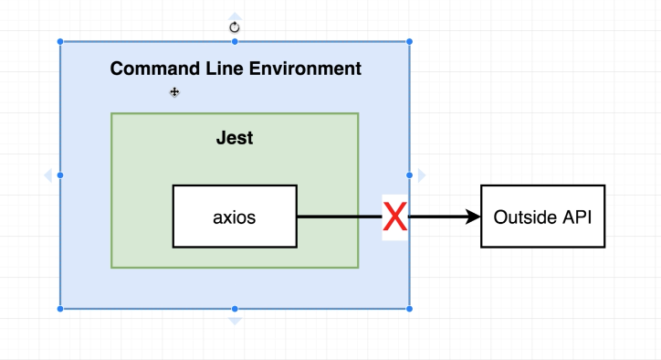
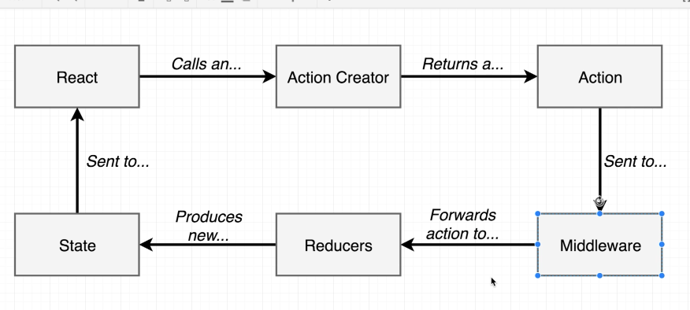
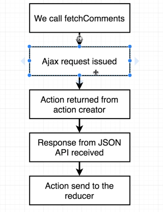
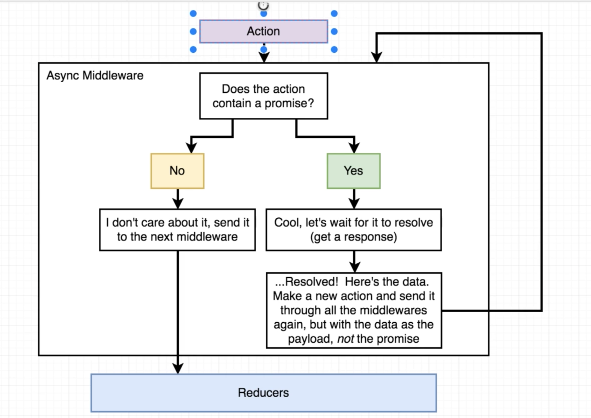

# Testing



`create-react-app` gives us the following dependencies:

#### React

The library

#### Webpack

Links together JS files

#### Jest

Automated test runner

`npm test` or `npm run test` did the following:

1. Test test running stars up
2. Jest finds all files ending in `.test.js` and executes tests inside of them
3. Jest prints out results of tests to the terminal
4. Jest waits for a file to change, then runs all tests again

## Redux Design

#### State

- `comments` for example `["I'm a comment", "Another comment"]`

#### Actions

- `saveComment` Adds a comment via the 'comments' reducer

## Component Design

App Component

- CommentBox Component
- CommentList Component

## Flow

Anytime you run tests, follow these steps:

1. Look at each individual part of your application (Reducer, Action, Component, Hook, etc)
2. Imagine telling a friend 'heres what this piece of code does'
3. Write a test to verify each part does what you expect

### Jest Basics

Jest will read files the following structure:

`/components`

- `/_tests`
- - `App.js`
- - `App.test.js`
- - `App.spec.js`
- `App.js`
- `App.spec.js`
- `App.test.js`

### Test Structure

`it` - global function (not need to import)
`(args1)` - string description of the test we are running; used to communicate intent
`(args2)` - function that has the test logic

Jest is ran from the command line environment
React code is ran from the browser

Jest installs `JSDOM`, which is a JavaScript implementation of the DOM and imitates the browser when we run test

`const div = document.createElement('div')` (creates a div, not a real div, exists in memory)
`ReactDOM.render(<App />, div)` (renders div)
`ReactDOM.unmountComponentAtNode(div)` (cleanup - looks at the div, finds the app component, and destroys that app component)

### Test Expectations

`expect` - global function
`(value)` - the value we want to verify
`mather statement` - designates how we want to inspect the 'subject'
`expected value` - expected value, its what we want our 'subject' to be

### Limiting Test Knowledge

You want to limit tests knowledge of other components and you want them to know they simply exist

### Enzyme

Created by AirBnB to easily test React components

Static Render

- A function we can pass a component and renders an object that just contains the HTML of that component

Shallow Render

- A function that takes a component and renders an instance of that component, it's attributes, but not it's children

Full DOM Render

- A functions that takes a component and renders an instant of that component, it's attributes, and all it's children as well as all attributes (onClick, etc)

### beforeEach | afterEach

Helper functions help reduce repetitive code. For example, a common dependency or cleanup

### Simulating events

Find the element
Simulate an event
provide a fake event object
force the component to update
assert the values have changed

`.simulate`
allows us to mock an event

When `setState` is called, the component is re-rendered asynchronously. This is an issue when it comes to testing, because we need to wait for the re-render to kick in

`.update`
forces the component to re-render

`.prop(key)`
allows us to pull props from an element

### Describe

The `describe` function in Jest allows us to group tests together

## Redux

Redux Store (provider)
|
App
|**_ CommentBox (connect)
|
|_** CommentList (connect)

actionCreator

takes a string and dispatches an action of a give type based on that string

When testing with redux, it is helpful to extract our redux setup (from `index.js`) into it's own component

We can use `props.children` (feature of React) to wrap other components

```javascript
export default (props) => {
  return <Provider store={createStore(reducers, {})}>{props.children}</Provider>
}

ReactDOM.render(
  <Root>
    <App />
  </Root>,
  document.querySelector('#root')
)
```

In this case, `props.children` is equal to our `<App />` component

When testing reducers and action creators, create testing directories inside the matching directory.
When testing reducers, you can create mock actions and reducers like so:

```javascript
it('handles actions of type SAVE_COMMENT', () => {
  const action = {
    type: SAVE_COMMENT,
    payload: 'New Comment',
  }
  const newState = commentsReducer([], action)

  expect(newState).toEqual(['New Comment'])
})
```

It is important to test your reducers to handle actions with unknown types:

```javascript
it('handles action with unknown type', () => {
  const newState = commentsReducer([], { type: 'UNKNOWN_TYPE' }) // the action can also be {}

  expect(newState).toEqual([]) // default case in reducer
})
```

When testing actions, you need to check the type and payload:

```javascript
describe('saveComment', () => {
  it('has the correct type', () => {
    const action = saveComment()

    expect(action.type).toEqual(SAVE_COMMENT)
  })

  it('has the correct payload', () => {
    const action = saveComment('New Comment')

    expect(action.payload).toEqual('New Comment')
  })
})
```

If you need to set some sort of state for testing, you can initialize a state object in the `beforeEach` function and pass it as props to the store. You will need to make sure you initial state has a default value, because you can't pass undefined:

```javascript
beforeEach(() => {
  const initialState = {
    comments: ['Comment 1', 'Comment 2'],
  }

  wrapped = mount(
    <Root initialState={initialState}>
      <CommentList />
    </Root>
  )
})

export default ({ children, initialState = {} }) => {
  // set an initial state to `initialState` so you don't pass undefined
  return (
    <Provider store={createStore(reducers, initialState)}>{children}</Provider>
  )
}
```

## Integration Testing



In order to test xhr calls to external apis, we need some additional dependencies to make that happen.

There is a great library called moxios which allows you to mock api calls.

### Setup

```javascript
beforeEach(() => {
  moxios.install()
  moxios.stubRequest('http://jsonplaceholder.typicode.com/comments', {
    status: 200,
    response: [{ name: 'Fetched #1' }, { name: 'Fetched #2' }],
  })
})
```

### Cleanup

```javascript
afterEach(() => {
  moxios.uninstall()
})
```

### Wait for a response

```javascript
it('can fetch a list of comments and display them', (done) => {
  const wrapped = mount(
    <Root>
      <App />
    </Root>
  )

  wrapped.find('.fetch-comments').simulate('click')
  moxios.wait(() => {
    wrapped.update()
    expect(wrapped.find('li').length).toEqual(2)
    done()
    wrapped.unmount()
  })
})
```

### Middleware

Where does middleware come into play?



Applying middleware with `redux`

```javascript
applyMiddleware(reduxPromise)
```

What is happening with `redux-promise`



If we put a `debugger` statement in our commentsReducer on line 8, we can log out the action our console by just typing `action`. We we see a resolved promise with our comments in the response body.

If we remove the middleware and do the same, we will see a pending promise. This is because the action instantly gets passed to the reducer. The `redux-promise` middleware allows us to wait slightly longer for that promise to resolve or reject.

### Middleware Stack

In redux, we can have any many middleware pieces as we want. We refer to this as the middleware stack. When we have a middleware stack, each piece of middleware has the ability to inspect the action and decide if it needs to do something with it and then passes it on to the next.


### Making your own Middleware



Create a `middleware` directory inside `src`

When creating middleware, we have a series of functions that return each other.

```javascript
export default function ({ dispatch }) {
  return function (next) {
    return function (action) {

    }
  }
}
```

or...

```javascript
export default ({ dispatch }) => (next) => (action) => {
  //
}
```

or...

```javascript
export default ({ dispatch }) =>
  (next) =>
    (action) => {
      //
    }
```

Let's use option #2...