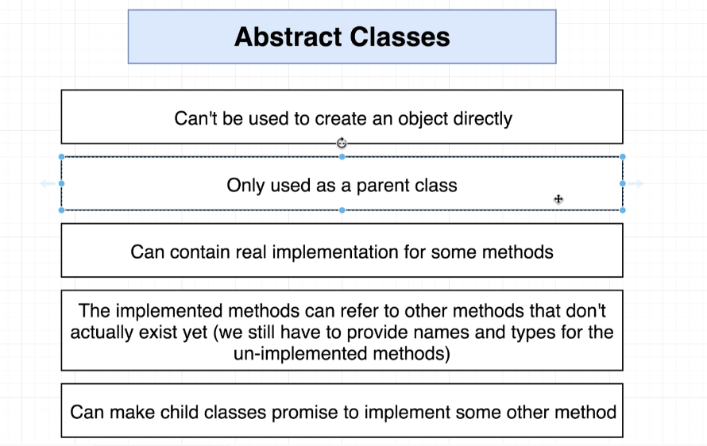

# Sort

In this example, we will create class called `Sorter` which can take a collection of numbers, a string, or a linked list. It will then, sort those collections from lowest to highest

## Sorter Class

```typescript
interface Sortable {
  length: number;
  compare(leftIndex: number, rigthIndex: number): boolean;
  swap(leftIndex: number, rigthIndex: number): void;
}

export class Sorter {
  constructor(public collection: Sortable) {}
  sort(): void {
    const { length } = this.collection;

    for (let i = 0; i < length; i++) {
      for (let j = 0; j < length - i - 1; j++) {
        if (this.collection.compare(j, j + 1)) {
          this.collection.swap(j, j + 1);
        }
      }
    }
  }
}
```

Here, we create an `interface` in order to define the requirements of what we pass into our `Sorter` class:

- length property
- compare function
- swap function

## NumbersCollection Class

```typescript
export class NumbersCollection {
  constructor(public data: number[]) {}

  get length(): number {
    return this.data.length;
  }

  compare(leftIndex: number, rightIndex: number): boolean {
    return this.data[leftIndex] > this.data[rightIndex];
  }

  swap(leftIndex: number, rightIndex: number): void {
    const leftValue = this.data[leftIndex];
    this.data[leftIndex] = this.data[rightIndex];
    this.data[rightIndex] = leftValue;
  }
}
```

## CharactersCollection Class

```typescript
export class CharactersCollection {
  constructor(public data: string) {}

  get length(): number {
    return this.data.length;
  }

  compare(leftIndex: number, rightIndex: number): boolean {
    const left = this.data[leftIndex].toLowerCase();
    const right = this.data[rightIndex].toLowerCase();
    return left > right;
  }

  swap(leftIndex: number, rightIndex: number): void {
    const characters = this.data.split('');
    const left = characters[leftIndex];
    characters[leftIndex] = characters[rightIndex];
    characters[rightIndex] = left;
    this.data = characters.join('');
  }
}
```

## LinkedList Class

```typescript
export class Node {
  constructor(public data: number) {}

  next: Node | null = null;
}
export class LinkedList {
  head: Node | null = null;

  add(data: number): void {
    const node = new Node(data);
    if (!this.head) {
      this.head = node;
      return;
    }
    let tail = this.head;
    while (tail.next) {
      tail = tail.next;
    }
    tail.next = node;
  }

  get length(): number {
    if (!this.head) {
      return 0;
    }
    let length = 1;
    let node = this.head;
    while (node.next) {
      length++;
      node = node.next;
    }
    return length;
  }

  at(index: number): Node {
    if (!this.head) {
      throw new Error('Index out of bounds');
    }
    let counter = 0;
    let node: Node | null = this.head;
    while (node) {
      if (counter === index) {
        return node;
      }
      counter++;
      node = node.next;
    }
    throw new Error('Index out of bounds');
  }

  compare(leftIndex: number, rightIndex: number): boolean {
    if (!this.head) {
      throw new Error('List is empty');
    }

    return this.at(leftIndex).data > this.at(rightIndex).data;
  }

  print(): void {
    if (!this.head) {
      return;
    }

    let node: Node | null = this.head;
    while (node) {
      console.log(node.data);
      node = node.next;
    }
  }

  swap(leftIndex: number, rightIndex: number): void {
    const leftNode = this.at(leftIndex);
    const rightNode = this.at(rightIndex);
    const leftValue = leftNode.data;
    leftNode.data = rightNode.data;
    rightNode.data = leftValue;
  }
}
```

This works, despite all three consistenting of different data types with different rules. For example, strings are immutable and the `swap` logic in `NumbersCollection` will not work for `CharactersCollection`. Therefore, we house the logic we need in each `class`, provide an `interface` to the `Sorter` class, and create and sort below:

```typescript
import { CharactersCollection } from './CharactersCollection';
import { LinkedList } from './LinkedList';
import { NumbersCollection } from './NumbersCollection';
import { Sorter } from './Sorter';

const charactersCollection = new CharactersCollection('Xaayb');
const numbersCollection = new NumbersCollection([50, 3, -5, 0]);

const linkedList = new LinkedList();
linkedList.add(500);
linkedList.add(-10);
linkedList.add(-3);
linkedList.add(4);

const sorter1 = new Sorter(numbersCollection);
const sorter2 = new Sorter(charactersCollection);
const sorter3 = new Sorter(linkedList);

sorter1.sort();
sorter2.sort();
sorter3.sort();

console.log(numbersCollection.data); // outputs - [ -5, 0, 3, 50 ]
console.log(charactersCollection.data); // outputs - 'aabXy'
linkedList.print(); // outputs = -10, -3, 4, 500
```

## Refactoring Sort to an Abstract Class

The code above proves to be reusable, but there is a refactor we can do to keep the code above from being so verbose. We can make `Sorter` and abstract class.

### Why Use An Abstract Class



### Abstract Sorter Class

```typescript
// abstract class
//    can't be used to create an object directly
//    only used as a parent class
//    can contain real implementation for some methods
//    the implemented methods can refer to other methods that don't actually exist yet (we still have to provide names and types for the un-implemented methods)
//    can make child classes promise to implement some other method

export abstract class Sorter {
  abstract compare(leftIndex: number, rightIndex: number): boolean;
  abstract length: number;
  abstract swap(leftIndex: number, rightIndex: number): void;

  sort(): void {
    const { length } = this;

    for (let i = 0; i < length; i++) {
      for (let j = 0; j < length - i - 1; j++) {
        if (this.compare(j, j + 1)) {
          this.swap(j, j + 1);
        }
      }
    }
  }
}
```

### NumbersCollection Class

```typescript
import { Sorter } from './Sorter';

// whenever we have a class that extends (inherits) from another, we need to call the super function inside the constructor to make sure setup code from the parent class gets executed

export class NumbersCollection extends Sorter {
  constructor(public data: number[]) {
    super();
  }

  get length(): number {
    return this.data.length;
  }

  compare(leftIndex: number, rightIndex: number): boolean {
    return this.data[leftIndex] > this.data[rightIndex];
  }

  swap(leftIndex: number, rightIndex: number): void {
    const leftValue = this.data[leftIndex];
    this.data[leftIndex] = this.data[rightIndex];
    this.data[rightIndex] = leftValue;
  }
}
```

### CharactersCollection Class

```typescript
import { Sorter } from './Sorter';

export class CharactersCollection extends Sorter {
  constructor(public data: string) {
    super();
  }

  get length(): number {
    return this.data.length;
  }

  compare(leftIndex: number, rightIndex: number): boolean {
    const left = this.data[leftIndex].toLowerCase();
    const right = this.data[rightIndex].toLowerCase();
    return left > right;
  }

  swap(leftIndex: number, rightIndex: number): void {
    const characters = this.data.split('');
    const left = characters[leftIndex];
    characters[leftIndex] = characters[rightIndex];
    characters[rightIndex] = left;
    this.data = characters.join('');
  }
}
```

### LinkedList Class

```typescript
import { Sorter } from './Sorter';

export class Node {
  constructor(public data: number) {}

  next: Node | null = null;
}

// if a class does not call a constructor(), we don't haven't to call super()

export class LinkedList extends Sorter {
  head: Node | null = null;

  add(data: number): void {
    const node = new Node(data);
    if (!this.head) {
      this.head = node;
      return;
    }
    let tail = this.head;
    while (tail.next) {
      tail = tail.next;
    }
    tail.next = node;
  }

  get length(): number {
    if (!this.head) {
      return 0;
    }
    let length = 1;
    let node = this.head;
    while (node.next) {
      length++;
      node = node.next;
    }
    return length;
  }

  at(index: number): Node {
    if (!this.head) {
      throw new Error('Index out of bounds');
    }
    let counter = 0;
    let node: Node | null = this.head;
    while (node) {
      if (counter === index) {
        return node;
      }
      counter++;
      node = node.next;
    }
    throw new Error('Index out of bounds');
  }

  compare(leftIndex: number, rightIndex: number): boolean {
    if (!this.head) {
      throw new Error('List is empty');
    }

    return this.at(leftIndex).data > this.at(rightIndex).data;
  }

  print(): void {
    if (!this.head) {
      return;
    }

    let node: Node | null = this.head;
    while (node) {
      console.log(node.data);
      node = node.next;
    }
  }

  swap(leftIndex: number, rightIndex: number): void {
    const leftNode = this.at(leftIndex);
    const rightNode = this.at(rightIndex);
    const leftValue = leftNode.data;
    leftNode.data = rightNode.data;
    rightNode.data = leftValue;
  }
}
```

Here, we set `CharactersCollection`, `NumbersCollection`, and `LinkedList` to extend our `Sorter` class. We also we set our `Sorter` class with the `abstract` keyword and define each property we expect our `child` classes to have. We no longer need our `inferface`. As you can see, we can call `sort` off of our collection class instances directly, making our clean cleaner:

```typescript
import { CharactersCollection } from './CharactersCollection';
import { LinkedList } from './LinkedList';
import { NumbersCollection } from './NumbersCollection';

const charactersCollection = new CharactersCollection('Xaayb');
const numbersCollection = new NumbersCollection([50, 3, -5, 0]);

// note: you cannot make an instance of an abstract class
//  calling new Sorter(linkedList) will throw an error

const linkedList = new LinkedList();
linkedList.add(500);
linkedList.add(-10);
linkedList.add(-3);
linkedList.add(4);

charactersCollection.sort();
numbersCollection.sort();
linkedList.sort();

console.log(numbersCollection.data);
console.log(charactersCollection.data);
linkedList.print();
```
